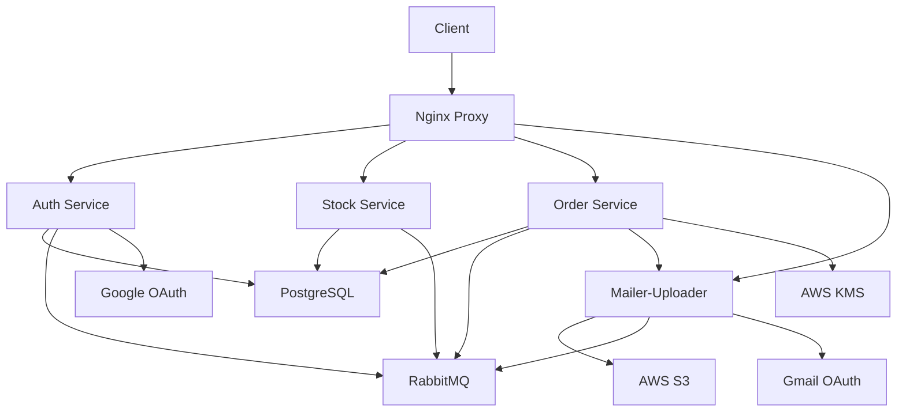

# Architecture Overview

## System Architecture

Cashvio uses a microservices architecture with the following components:

### Services

| Service | Development Port | Production Path | Description |
|---------|------------------|-----------------|-------------|
| Auth Service | 8080 | /auth (3010) | Authentication & user management |
| Mailer-Uploader | 8081 | /mailer (3001) | Email & file uploads |
| Stock Service | 8082 | /stock (3002) | Inventory management |
| Order Service | 8083 | /order (3003) | Order processing & cashflow |

### Infrastructure Components

#### Database
- **Type**: PostgreSQL
- **Usage**: Shared across all microservices
- **Purpose**: Persistent data storage

#### Message Broker
- **Type**: RabbitMQ
- **Purpose**: Inter-service communication
- **Management**: http://localhost:15672

#### Cloud Services
- **AWS S3**: File storage and uploads
- **AWS KMS**: Data encryption for order service
- **Google OAuth**: User authentication (separate config)
- **Gmail OAuth**: Email sending (separate config)

### Production Setup

#### Server Details
- **Provider**: AWS EC2
- **Region**: eu-north-1
- **Base URL**: `http://ec2-51-21-155-1.eu-north-1.compute.amazonaws.com`

#### Nginx Configuration
```nginx
# Route mappings:
/auth -> :3010 (Auth Service)
/stock -> :3002 (Stock Service) 
/order -> :3003 (Order Service)
/mailer -> :3001 (Mailer-Uploader Service)
```

## Service Communication



## Data Flow

1. **Authentication**: Users authenticate via Auth Service using Google OAuth
2. **Inventory Management**: Stock Service manages products, categories, and suppliers
3. **Order Processing**: Order Service handles transactions and updates inventory via RabbitMQ
4. **Notifications**: Mailer-Uploader sends email confirmations and manages file uploads
5. **Financial Tracking**: Order Service tracks cashflow and customer wallets